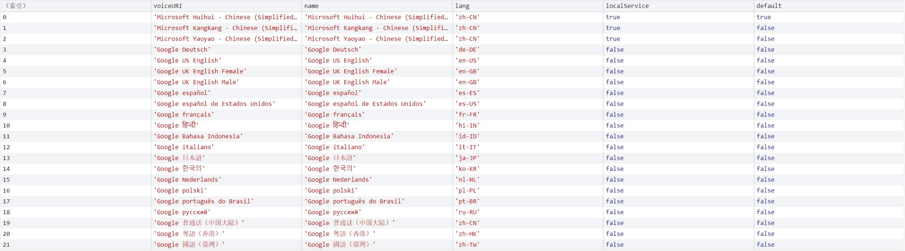
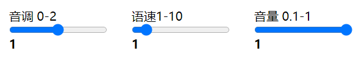
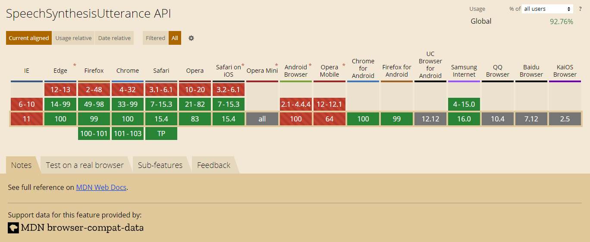

# 让你的浏览器开口说话

[在线体验地址](http://sites.zbztb.cn/让你的浏览器开口说话.html)

```
http://sites.zbztb.cn/让你的浏览器开口说话.html
```


## 背景介绍

之前自己做的一个点名系统，可以支持语音播报，内部是调用了百度的在线体验语音接口API的，但是现在百度接口改了，没有免费体验，要使用就只能注册申请，嫌麻烦，刚好也知道H5有播放语音的API。所以干脆就拿过来研究一下。

## 功能介绍

利用h5提供的语音播报API，可以实现以下几个功能

### 22种内置语言，包括大家喜欢的日语、粤语、国语、英语



### 还可以设置音调、语速、音量大小



## SpeechSynthesisUtterance  介绍


>  SpeechSynthesisUtterance 翻译为 **语音合成话语** 该接口表示一个语音请求。它包含了阅读和如何阅读的功能(例如语言、音高和音量)
>
> 代码中表示一个构造函数
>
> 需要搭配下面的 **speechSynthesis**   一起使用


```javascript
const utterThis = new SpeechSynthesisUtterance(); // 创建一个对象
```

### 属性

| 属性名 | 类型                        | 作用                     |
| ------ | --------------------------- | ------------------------ |
| text   | String                      | 设置要朗读的文字         |
| pitch  | Number                      | 设置音调  （0-2）        |
| rate   | Number                      | 设置语速 （1-10）        |
| volume | Number                      | 设置音量 (0-1)           |
| voice  | SpeechSynthesisVoice Object | 设置语言（粤语、国语等） |


## speechSynthesis  语音合成

> 负责设置语言和 和朗读功能
>
> 它是一个全局对象

### 方法

1. 静态方法 `speak` 接收由 `SpeechSynthesisUtterance`   创建的实例，进行播放语音
2. 静态方法 `getVoices` 用来获取可以使用的语言（国语或者粤语等）


## 兼容性




## 基本代码

```html
<!DOCTYPE html>
<html lang="en">
  <head>
    <meta charset="UTF-8" />
    <meta
      name="viewport"
      content="width=device-width, initial-scale=1.0,maximum-scale=1,minimum-scale=1,user-scalable=no"
    />
    <title>2.html</title>
    <style>
      * {
        margin: 0;
        padding: 0;
        box-sizing: border-box;
      }
    </style>
  </head>
  <body>
    <button>播放</button>

    <script>
      const button = document.querySelector('button');
      // 必须由用户主动触发，才有效
      button.addEventListener('click', function () {
        speechSynthesis.speak(new SpeechSynthesisUtterance(`你是我的神`));
      });
    </script>
  </body>
</html>

```


## 小案例

```html
<!DOCTYPE html>
<html lang="en">
  <!-- <html lang="zh-CN"> -->
  <!-- <html lang="zh-HK"> -->
  <head>
    <meta charset="UTF-8" />
    <meta
      name="viewport"
      content="width=device-width, initial-scale=1.0,maximum-scale=1,minimum-scale=1,user-scalable=no"
    />
    <title>让你的浏览器开口说话</title>
    <style>
      * {
        margin: 0;
        padding: 0;
        box-sizing: border-box;
      }
      button {
        display: block;
        margin: 0 auto;
        width: 200px;
        height: 50px;
        font-size: 30px;
        background-color: powderblue;
        border-radius: 10px;
        border: none;
        cursor: pointer;
      }

      .tool {
        width: 1000px;
        margin: 20px auto;
        font-size: 16px;
        display: flex;
        justify-content: space-around;
        align-items: center;
        height: 100px;
      }
      input {
        display: block;
      }
      .word {
        position: fixed;
        width: 85%;
        left: 50%;
        bottom: 10%;
        transform: translateX(-50%);
        background-color: #000;
        color: #fff;
        line-height: 1.5;
        font-size: 25px;
        padding: 10px;
      }
    </style>
  </head>
  <body>
    <div class="tool">
      <div class="item">
        <span>请输入说话的内容</span>
        <input type="text" value="执翻剂" class="text" style="height: 30px" />
      </div>
      <div class="item">
        <span>音调 0-2</span>
        <div>
          <input
            value="1"
            type="range"
            class="pitch"
            min="0"
            max="2"
            step="1"
          />
          <b>1</b>
        </div>
      </div>
      <div class="item">
        <span>语速1-10</span>
        <div>
          <input
            value="1"
            type="range"
            class="rate"
            min="0.1"
            max="10"
            step="0.2"
          />
          <b>1</b>
        </div>
      </div>
      <div class="item">
        <span>音量 0-1</span>
        <div>
          <input
            value="1"
            type="range"
            class="volume"
            min="0"
            max="1"
            step="0.1"
          />
          <b>1</b>
        </div>
      </div>
      <div class="item">
        <span>语言</span>
        <select class="voice"></select>
      </div>
    </div>
    <button>播放</button>

    <script>
      window.onload = function () {
        const button = document.querySelector('button');
        const textDom = document.querySelector('.text');
        const pitchDom = document.querySelector('.pitch');
        const rateDom = document.querySelector('.rate');
        const voiceDom = document.querySelector('.voice');
        const volumeDom = document.querySelector('.volume');
        let voices;

        pitchDom.addEventListener('input', setValue);
        rateDom.addEventListener('input', setValue);
        volumeDom.addEventListener('input', setValue);

        function setValue(event) {
          if (event.target.nextElementSibling.nodeName === 'B') {
            event.target.nextElementSibling.innerText = event.target.value;
          }
        }

        speechSynthesis.onvoiceschanged = function (e) {
          voices = speechSynthesis.getVoices();
          voiceDom.innerHTML = voices
            .map(
              (v, i) => `<option value="${i}">
            ${v.name.replace(/(Google)|(Microsoft)/, '')}
            </option>`
            )
            .join('');
        };

        button.addEventListener('click', function () {
          let utterThis = new SpeechSynthesisUtterance();
          const text = textDom.value;
          const pitch = pitchDom.value;
          const rate = rateDom.value;
          const volume = volumeDom.value;
          const voice = voiceDom.value;

          utterThis.text = text;// 设置要约定的文本
          utterThis.pitch = pitch;// 设置音调
          utterThis.rate = rate; // 设置语速
          utterThis.voice = voices[voice]; // 设置语言 
          utterThis.volume = volume;// 设置音量
          speechSynthesis.speak(utterThis); // 开始朗读

          const word = document.createElement('div');
          word.innerText = text;
          word.classList.add('word');
          document.body.appendChild(word);
          utterThis.onend = function () {
            setTimeout(() => {
              word.remove();
            }, 1000);
          };
        });
      };
    </script>
  </body>
</html>

```


